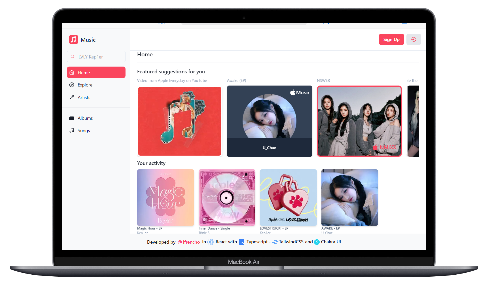
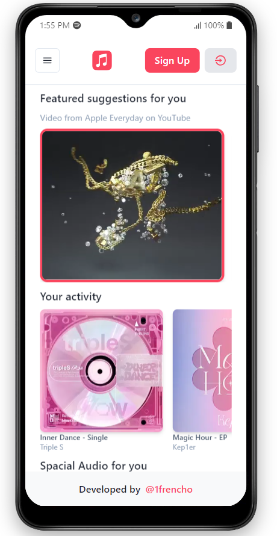

# Apple Music Demo Clone (Not finished)

Task developed by [**@1frencho**](https://github.com/1frencho) assigned from Kodigo Academy.

### Desktop Demo



### Mobile Demo



## Technologies used

- Vanilla JS (Build with Vite)
- TypeScript

## Libraries used:

- Tailwind CSS
- Chakra UI (UI) - Just for Layout (SideMenu, Drawer, NavBar), other components are made with Tailwind CSS
- Framer Motion
- React Hook Form (Task applied on SignUp and SignIn)
- Yup with React Hook Form
- React Router
- React Icons

## Use development workspace:

```
npm install
```

```
npm run dev
```
