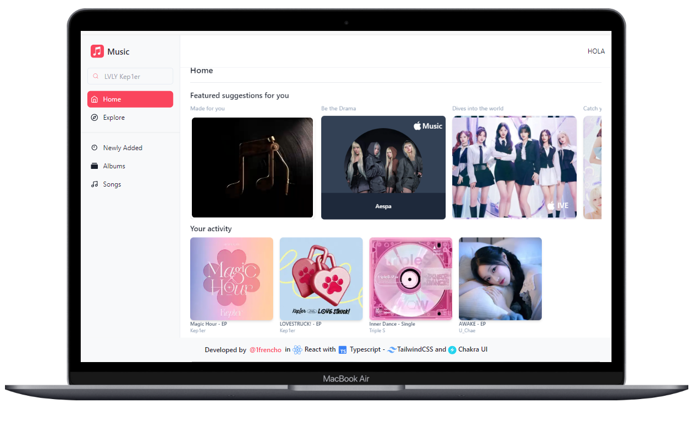

# Apple Music Demo Clone (Not finished)

Task developed by [**@1frencho**](https://github.com/1frencho) assigned from Kodigo Academy.



- Questions provided by ChatGPT on /src/data

## Technologies used

- Vanilla JS (Build with Vite)
- TypeScript

## Libraries used:

- Tailwind CSS
- Chakra UI (UI)
- Framer Motion

## Use development workspace:

```
npm install
```

```
npm run dev
```
